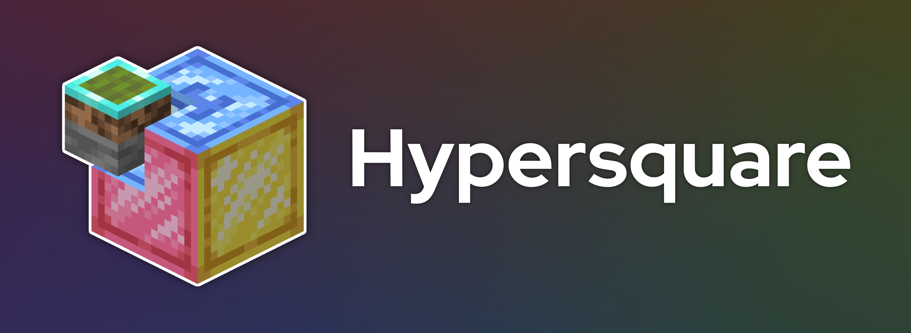

# Hypersquare

Hypersquare is a remake of the popular server DiamondFire. 
We aim to include all the most requested features by the community, as well as some quality of life features.

⚠ The project is still in development, some features are not done yet.

## Discord
You can contact us or join the community by joining the discord [here](https://discord.gg/uyXGY73kdw)

## Contributing
You can contribute by fixing inefficiencies, mistakes or oversights made by us in the code, as well as adding new features.

(Please keep your PRs clean and concise, and use [conventional commit messages](https://www.conventionalcommits.org/en/v1.0.0/))

### Dev Setup
1. Clone the repository
2. Build the project
3. Run the jar in an empty folder either with the CLI or GUI:
   * CLI: Run `java -jar hypersquare.jar devsetup`
   * GUI: Double-click the jar and press the button
4. Run the server, it should give errors at first, close it and then proceed to the next step
5. In `plugins/SlimeWorldManager/sources.yml` look under `mongodb:` and set `enabled: true` and fill out database info sent by `@_1chicken_` on discord, or use your own database
6. In `plugins/hypersquare/config.yml`, `DB_PASS` should be set to the database URL and `DB_NAME` to your database name (if not given by Chicken)

## Credits
Thanks to all contributors and DiamondFire for inspiring us!

